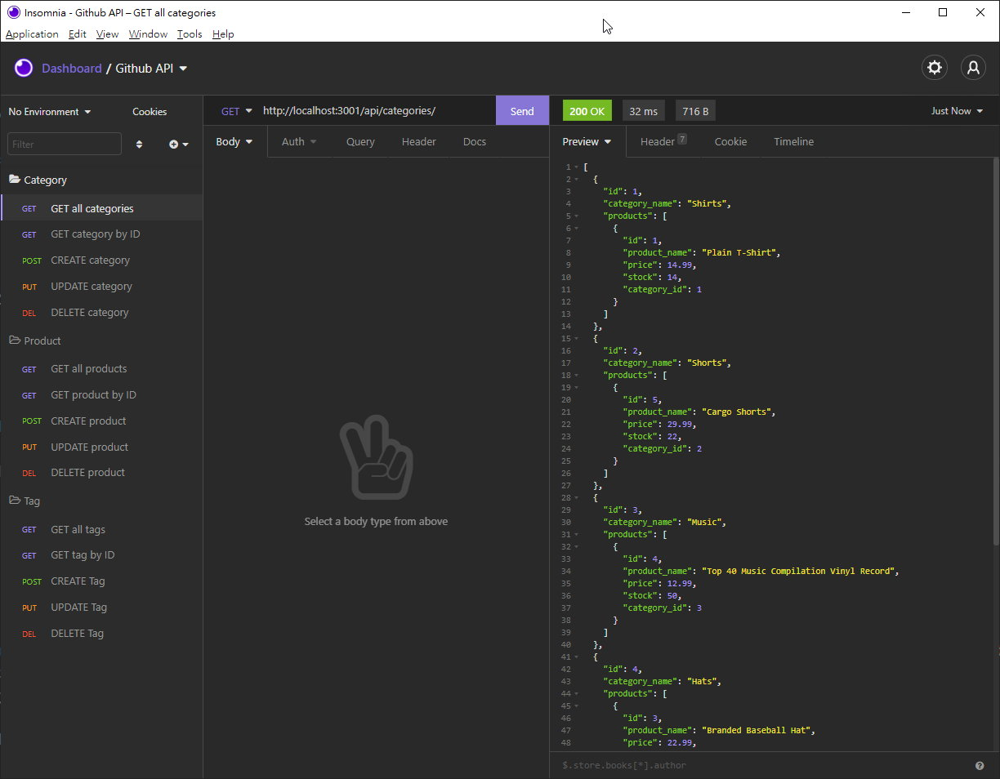

[](https://opensource.org/licenses/MIT)

# 13-e-commerce-back-end

This is a E-commerce Back End database application. The database keeps track of a retail store which include its products, product tags and product categories info.

## Table of Contents
1. [Setup](#setup)
2. [Design](#design)
3. [Links](#links)
4. [Demo](#demo)
5. [License](#license)

<a name="setup"></a>

## Setup

Before start, make sure there's a database selected. You will need to run commands in mysql shell to execute the schema.sql under the "db" folder. Log in to your mysql, then:

```
source ./db/schema.sql;
```

Once you have the database created, you can feed the app with existing seeds in the command line and start the app with below command:

```
npm install
npm run seed
npm start
```

<a name="design"></a>

## Design

* Updated the connection to use sequalize in the server.js
* Created all database models including Category, Product, ProductTag and Tag under the models folder
* Updated all routes in the routes/api folder including each route's GET, GET by ID, POST, PUT, DELETE
* Using Insomnia to run and test the application and its functions

<a name="links"></a>

## Links

Please check out [Github Page](https://github.com/shaotangyen/13-e-commerce-back-end) for the app.

<a name="demo"></a>

## Demo

The following video link demonstrates the Employee Tracker app: [Click to watch](https://drive.google.com/file/d/14loWsRMsekgvExQdZG7yewDihMNHqCau/view?usp=sharing).



<a name="license"></a>

## License

Copyright 2021 Shao Yen

Permission is hereby granted, free of charge, to any person obtaining a copy of this software and associated documentation files (the "Software"), to deal in the Software without restriction, including without limitation the rights to use, copy, modify, merge, publish, distribute, sublicense, and/or sell copies of the Software, and to permit persons to whom the Software is furnished to do so, subject to the following conditions:

The above copyright notice and this permission notice shall be included in all copies or substantial portions of the Software.

THE SOFTWARE IS PROVIDED "AS IS", WITHOUT WARRANTY OF ANY KIND, EXPRESS OR IMPLIED, INCLUDING BUT NOT LIMITED TO THE WARRANTIES OF MERCHANTABILITY, FITNESS FOR A PARTICULAR PURPOSE AND NONINFRINGEMENT. IN NO EVENT SHALL THE AUTHORS OR COPYRIGHT HOLDERS BE LIABLE FOR ANY CLAIM, DAMAGES OR OTHER LIABILITY, WHETHER IN AN ACTION OF CONTRACT, TORT OR OTHERWISE, ARISING FROM, OUT OF OR IN CONNECTION WITH THE SOFTWARE OR THE USE OR OTHER DEALINGS IN THE SOFTWARE.
